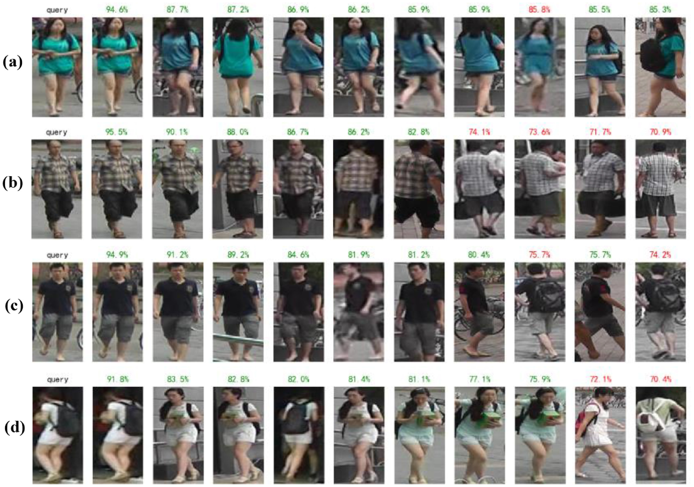

HJL-re-id
=========
- An awesome project for person re-id. 
- This project contains adequate support for `log recording`, `loss monitoring` and `visualization ranked images`.
- This is the pytorch implementation the paper [*Joint multi-scale discrimination and region segmentation for person re-ID*](https://www.sciencedirect.com/science/article/pii/S0167865520303275#bib0023).

# Introduction
- This repository is for person re-id including supervised learning, unsupervised learning and occluded person re-id task. You can utilize this code to learn how to make `person re-id`tasks. 
- For HJL, this is my name initials -- Huang Jialiang.
- I has estabilished the structure containing the introduction of person re-id models like `PCB`,`MGN` and `MDRS`(my paper), `PGFA` and `HOReID`. These structures are all reproduced by myself in this code framework.
- If you have any quesions, please contact me by my email. 
- My emails is: *nickhuang1996@126.com*.

# Citation

If you find our work useful, please kindly cite our paper:
```
@article{huang2020MDRS,
  title={Joint multi-scale discrimination and region segmentation for person re-ID},
  author={Huang, Jialiang and Lio, bo and Fu, lihua},
  journal={Pattern Recognition Letters},
  year={2020}
}
```

# MDRS
- Name: [*Joint multi-scale discrimination and region segmentation for person re-ID*](https://www.sciencedirect.com/science/article/pii/S0167865520303275#bib0023)
- Journal: [*Pattern Recognition Letters*](https://www.sciencedirect.com/journal/pattern-recognition-letters)
- JCR: Q2
- web of science
## Architecture

 
 ## Ranked Images

- Re-ID examples of MDRS on Market-1501 dataset. The retrieved images are all from the gallery set with similarity scores shown above each image. Images with similarity scores in red are negative results. The introduction of multi-scale discriminative feature extraction and region segmentation boost the Re-ID performance.

### Dependencies
 - Python >= 3.6
 - Pytorch >= 1.0.0
 - Numpy
 - tqdm
 - scipy
 - torchvision==0.2.1
 
# Dataset Structure
- Main structure illustrates the data structure for person re-id.

## Main Structure
- [market1501-structure](#market1501-structure)
- [duke-structure](#duke-structure)
- [cuhk03_np_detected_jpg-structure](#cuhk03_np_detected_jpg-structure)
```
${project_dir}/ReID_dataset
    market1501
        Market-1501-v15.09.15                   # Extracted from Market-1501-v15.09.15.zip, http://www.liangzheng.org/Project/project_reid.html
        Market-1501-v15.09.15_ps_label
        bounding_box_train_duke_style
    duke
        bounding_box_train_market1501_style
        DukeMTMC-reID                           # Extracted from DukeMTMC-reID.zip, https://github.com/layumi/DukeMTMC-reID_evaluation
        DukeMTMC-reID_ps_label
        Occluded_Duke
    cuhk03_np_detected_jpg
        cuhk03-np                               # Extracted from cuhk03-np.zip, https://pan.baidu.com/s/1RNvebTccjmmj1ig-LVjw7A
        cuhk03-np-jpg                           # Created from code
        cuhk03-np-jpg_ps_label
``` 
### market1501 structure
```
${project_dir}/ReID_dataset/market1501
    Market-1501-v15.09.15                       # Extracted from Market-1501-v15.09.15.zip, http://www.liangzheng.org/Project/project_reid.html
        bounding_box_test
        bounding_box_train
        bounding_box_train_camstyle             # unsupervised learning
        bounding_box_train_resize               # 256×256
        gt_bbox
        gt_query
        pytorch
            gallery
            multi-query
            query
            train
            train_all
            val
        query
    Market-1501-v15.09.15_ps_label              # segmentation label 
        bounding_box_test
        bounding_box_train
        gt_bbox
        query
    bounding_box_train_duke_style
``` 

### duke structure
```
${project_dir}/ReID_dataset/duke
    bounding_box_train_market1501_style
    DukeMTMC-reID                               # Extracted from DukeMTMC-reID.zip, https://github.com/layumi/DukeMTMC-reID_evaluation
        bounding_box_test
        bounding_box_train
        bounding_box_train_camstyle             # unsupervised learning
        pytorch
            gallery
            query
            train
            train_all
            val
        query
    DukeMTMC-reID_ps_label                      # segmentation label 
        bounding_box_test
        bounding_box_train
        gt_bbox
        query
    Occluded_Duke
        bounding_box_test
        bounding_box_train
        heatmaps                                # .npy files
            bounding_box_test
            bounding_box_train
            processed_data
                gallery
                query
                train 
        processed_data                          # person ID is folder name
            gallery
            query
            train
        query
        test_pose_storage
            gallery
                sep-json
                alphapose-results.json
                gallery.list
                show.py
            query
                sep-json
                1.list
                0184_c4_f0056533.jpg
                0184_c4_f0056533a.jpg
                alphapose-results.json
                show.py
                show1.py
``` 

### cuhk03_np_detected_jpg structure
```
${project_dir}/ReID_dataset/cuhk03_np_detected_jpg
    cuhk03-np                              # Extracted from cuhk03-np.zip, https://pan.baidu.com/s/1RNvebTccjmmj1ig-LVjw7A
        datected
            bounding_box_test
            bounding_box_train
            pytorch
                gallery
                query
                train
                train_all
                val
            query
        labeled
            bounding_box_test
            bounding_box_train
            query
    cuhk03-np-jpg                         # Created from code
        detected
            bounding_box_test
            bounding_box_train
            pytorch
                gallery
                query
                train
                train_all
                val
            query
        labeled
            bounding_box_test
            bounding_box_train
            pytorch
                gallery
                query
                train
                train_all
                val
            query
    cuhk03-np-jpg_ps_label
        bounding_box_test
        bounding_box_train
        query    
``` 

## Models
| Name | Baidudisk |
|------|------|
| ResNet50 | - |
| MDRS_market | - |
| MDRS_duke | - |
| MDRS_cuhk | - |

- Pretrained models(*ResNet50*) restores `backbone` weights.
- `HJL-ReID` is the project name, where three datasets results and weights are produced after training.
- `MDRS_feat_dict.mat` restores gallery and query data features by extracted from trained models for evaluations.
- You are supposed to download and save these files according to the following structure:
```
${project_dir}/weights_results
    pretrained_models
        resnet50-19c8e357.pth
    HJL-ReID
        MDRS_ADAM_random_erasing_margin_0.3_market_best
            tensorboard
            ckpt.pth
            default_config.py
            MDRS_feat_dict.mat
        MDRS_ADAM_random_erasing_margin_0.3_duke_best
            ...
        MDRS_ADAM_random_erasing_margin_0.3_cuhk_best
            ...
        ...
```

# Train and Test
### No IDE
- if you want to command, followed by:
- `python demo.py --model_name MDRS
    --exp_dir ${project_dir}/weights_results/HJLReID/MDRS_ADAM_random_erasing_margin_0.3_market_best
    --default_config_path $(project_dir)/HJLReID/MDRSREID/Settings/config/default_config.py
    --ow_config_path $(project_dir)/HJLReID/MDRSREID/Settings/config/overwrite_config/MDRS_config_ADAM_best_market1501.txt
    --ow_str cfg.dataset.train.name = 'market1501'`
### IDE
- or if you have IDE like `pycharm`, you can just modify `MDRSREID/parser_args/parser_args.py`
- You just modify `--exp_dir` and `--ow_config_path`. Then run `demo.py`.

|dataset| exp_dir | ow_config_path |
|---|---|---|
| market | ${project_dir}/weights_results/HJL-ReID/MDRS_ADAM_random_erasing_margin_0.3_market_best | $(project_dir)/HJL-ReID/MDRSREID/Settings/config/overwrite_config/MDRS_config_ADAM_best_market1501.txt |
| duke | ${project_dir}/weights_results/HJL-ReID/MDRS_ADAM_random_erasing_margin_0.3_duke_best | $(project_dir)/HJL-ReID/MDRSREID/Settings/config/overwrite_config/MDRS_config_ADAM_best_duke.txt |
| cuhk03 | ${project_dir}/weights_results/HJL-ReID/MDRS_ADAM_random_erasing_margin_0.3_cuhk_jpg_best | $(project_dir)/HJL-ReID/MDRSREID/Settings/config/overwrite_config/MDRS_config_ADAM_best_cuhk03_jpg.txt |
- If you want to test, just modify `cfg.only_test = False` to `cfg.only_test = True` in `./MDRSREID/Settings/config/overwrite_config/${config_file}`

### Config files
Overwrite config files can be found in: [./MDRSREID/Settings/config/overwrite_config/](MDRSREID/Settings/config/overwrite_config)

| config_file |
| -------------- |
| MDRS_config_ADAM_best_market1501.txt |
| MDRS_config_ADAM_best_duke.txt |
| MDRS_config_ADAM_best_cuhk_jpg.txt |
| ... |
- e.g:
```
import argparse


def parser_args():
    """
    :argument:
        --exp_dir
        --default_config_path
        --ow_config_path
        --ow_str
    :return:
    """
    parser = argparse.ArgumentParser()
    parser.add_argument('--model_name',
                        type=str,
                        default='MDRS',
                        help='[Optional] Model Name for experiment directory in current directory if exp_dir is None')
    parser.add_argument('--exp_dir',
                        type=str,
                        default='D:/weights_results/HJL-ReID/MDRS_ADAM_random_erasing_margin_0.3_market_best',
                        help='[Optional] Directory to store experiment output, '
                             'including log files and model checkpoint, etc.')
    parser.add_argument('--default_config_path',
                        type=str,
                        default='D:/Pycharm_Project/HJL-ReID/MDRSREID/Settings/config/default_config.py',
                        help='A configuration file.')
    parser.add_argument('--ow_config_path',
                        type=str,
                        default='D:/Pycharm_Project/HJL-ReID/MDRSREID/Settings/config/overwrite_config/MDRS_config_ADAM_best_market1501.txt',
                        help='[Optional] A text file, each line being an item to overwrite the cfg_file.')
    parser.add_argument('--ow_str',
                        type=str,
                        default='cfg.dataset.train.name = \'market1501\'',
                        help="""[Optional] Items to overwrite the cfg_file. 
                        E.g. "cfg.dataset.train.name = \'market1501\''; cfg.model.em_dim = 256" """)
    args, _ = parser.parse_known_args()
    return args

```

# Performances
## Market1501
| Methods | mAP |	Rank-1 | Rank-5 |	Rank-10 | 
|---|---|---|---|---|
| MDRS |	87.6 | 95.8 |	98.4 | 99.1 |
| Pyramid | 88.2 | 95.7 | 98.4 | 99.0 |
| DSA-reID | 87.6 | 95.7	| – |	– |
| MGN | 86.9 | 95.7 | – | – |
| PCB+triplet | 83.0 | 93.4 | 97.8 | 98.4 |
| CASN(PCB) | 82.8 | 94.4 | – | – |
| PCB+RPP | 81.6 | 93.8 | 97.5 | 98.5 |
| VPM | 80.8 | 93.0 | 97.8 | 98.8 | 
| PCB | 77.4 | 92.3 | 97.2 | 98.2 | 
| GLAD | 73.9 | 89.9 | – | – |
| MultiScale | 73.1 | 88.9 | – | – |
| PartLoss | 69.3 | 88.2 | – | – |
| PDC | 63.4 | 84.4 | – | – |
| MultiLoss | 64.4 | 83.9 | – | – |
| PAR | 63.4 | 81.0 | 92.0 | 94.7 |
| HydraPlus | – | 76.9 | 91.3 | 94.5 |
| MultiRegion | 41.2 | 66.4 | 85.0 | 90.2 |
| SPReID |	83.4 | 93.7 | 97.6 | 98.4 |
| AOS | 70.4 | 86.5 | – | – |
| Triplet Loss | 69.1 | 84.9 | 94.2 | – |
| Transfer | 65.5 | 83.7 | – | – |
| PAN | 63.4 | 82.8 | – | – |
| SVDNet | 62.1 | 82.3 | 92.3 | 95.2 |

## DukeMTMC-reID
| Methods | mAP |	Rank-1 | Rank-5 |	Rank-10 | 
|---|---|---|---|---|
| MDRS | 79.4 | 89.4 | 95.1 | 96.8 |
| Pyramid | 79.0 | 89.0 | 94.7 | 96.3 |
| MGN | 78.4 | 88.7 | – | – |
| CASN(PCB) | 73.7 | 87.7 | – | – |
| DSA-reID | 74.3 | 86.2 | – | – |
| SPReID | 73.3 | 86.0 | 93.0 | 94.5 |
| PCB+triplet | 73.2 | 84.1 | 92.4 | 94.5 |
| VPM | 72.6 | 83.6 | 91.7 | 94.2 |
| PCB+RPP | 69.2 | 83.3 | – | – |
| PSE+ECN | 75.7 | 84.5 | – | – |
| DNN + CRF | 69.5 | 84.9 | – | – |
| GP-reid | 72.8 | 85.2 | – | – |
| AOS | 62.1 | 79.2 | – | – |

## CUHK03
| – | Labelled | - | - | - | Detected | - | - | - |
|---|---|---|---|---|---|---|---|---|
| Methods | mAP |	Rank-1 | Rank-5 |	Rank-10 | mAP |	Rank-1 | Rank-5 |	Rank-10 | 
| MDRS | 76.4 | 79.0 | 91.1 | 94.6 | 74.2 | 78.7 | 90.5 | 94.1 |
| Pyramid | 76.9 | 78.9 | 91.0 | 94.4 | 74.8 | 78.9 | 90.7 | 94.5 |
| DSA-reID | 75.2 | 78.9 | – | – | 73.1 | 78.2 | – | – |
| CASN(PCB) | 68.0 | 73.7 | – | – | 64.4 | 71.5 | – | – |
| MGN | 67.4 | 68.0 | – | – | 66.0 | 68.0 | – | – |
| PCB+RPP | – | – | – | – | 57.5 | 63.7 | – | – |
| MLFN | 49.2 | 54.7 | – | – | 47.8 | 52.8 | – | – |
| AOS | – | – | – | – | 43.3 | 47.1 | – | – |
| SVDNet | 37.8 | 40.9 | – | – | 37.3 | 41.5 | – | – |
| PAN | 35.0 | 36.9 | – | – | 34.0 | 36.3 | – | – |
| IDE | 21.0 | 22.2 | – | – | 19.7 | 21.3 | – | – |


